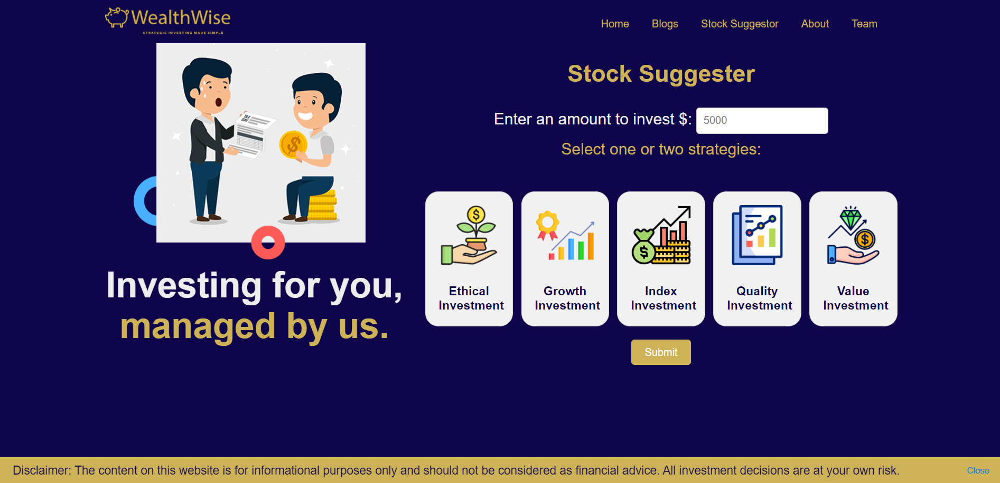
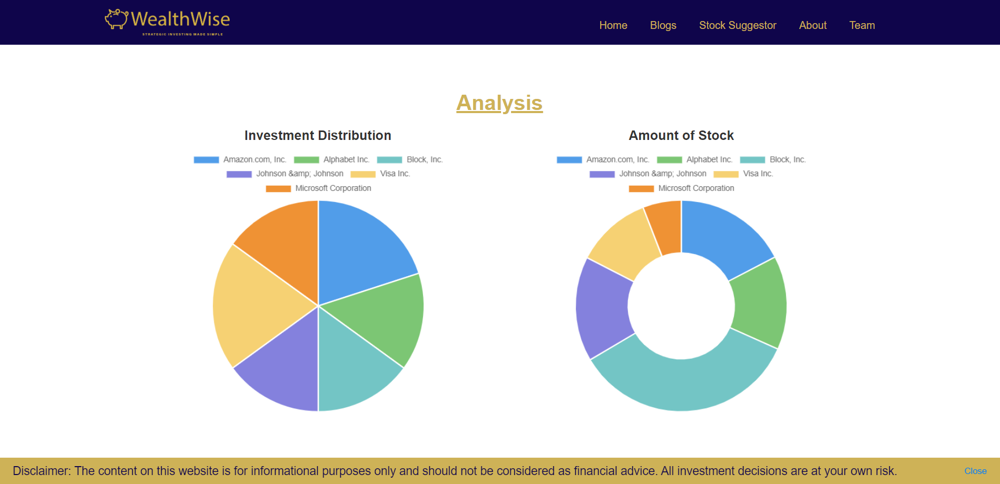
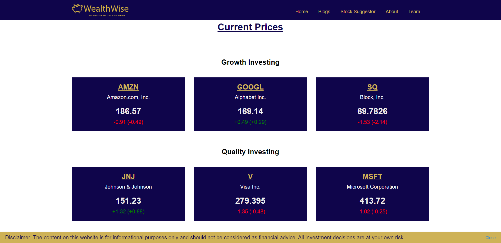
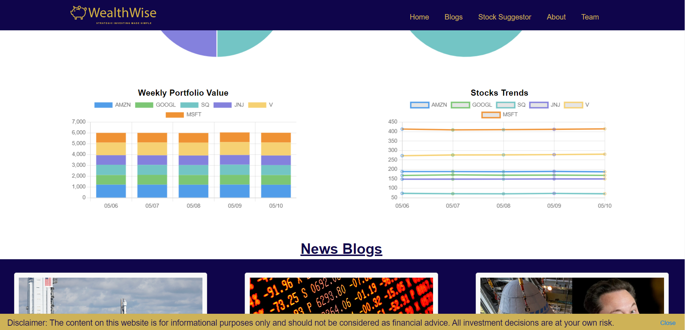

# Stock Portfolio Suggestion Engine

**Final project for CMPE 285 - SJSU Spring 2024**

## Use Case:

### User Inputs:
- Dollar amount to invest in USD (Minimum is $5000 USD)
- Pick one or two investment strategies:
  - Ethical Investing
  - Growth Investing
  - Index Investing
  - Quality Investing
  - Value Investing

## Engine Output:
- Selected stocks based on inputted strategies.
- Distribution of the invested money among suggested stocks.
  
- Current values (up to the second via the Internet) of the overall portfolio (including all stocks / ETFs).
  
- Weekly trend of the portfolio value. In other words, keep a 5-day history of the overall portfolio value.
  

## Installation Guide

### Pre-requisites
- Python

### Installation (Windows)
1. Clone the repository
2. Open a terminal in the root folder of the repository
3. Create a virtual environment using `python -m venv myenv`
4. Activate the virtual environment using `myenv\Scripts\activate`
5. Install the dependencies using `pip install -r requirements.txt`
6. Run the application using `flask run`
7. Open [http://127.0.0.1:5050](http://127.0.0.1:5050)

## Team:

### Guide to Using Flask:
[Flask Development and Deployment Guide](https://github.com/pushyachandra/Flask_Dev_Deployment/tree/main)
